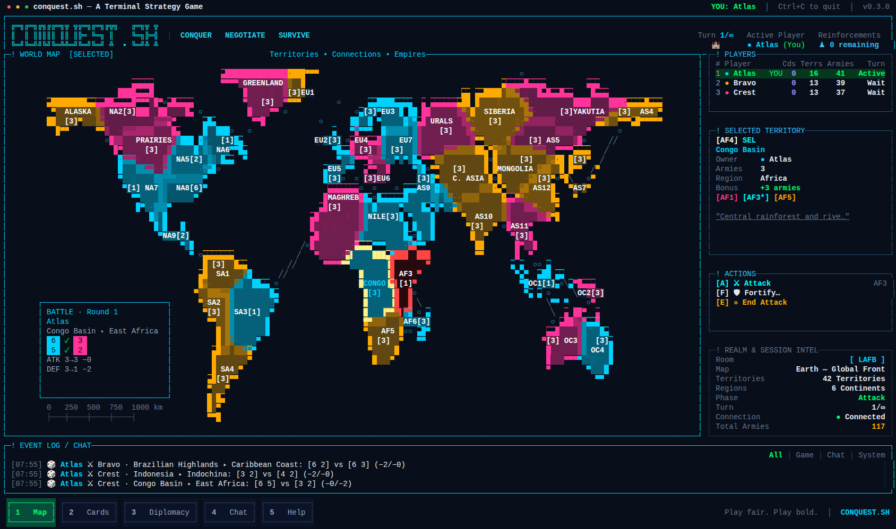
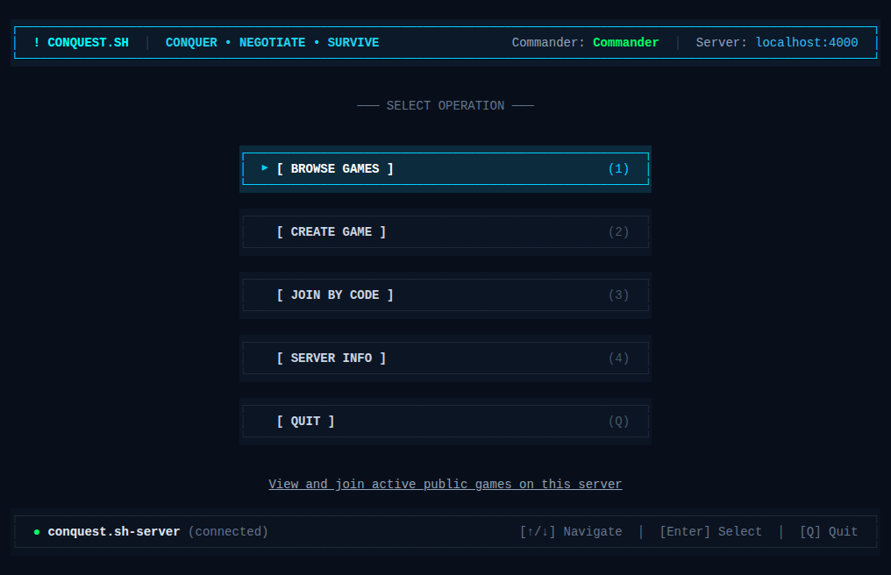
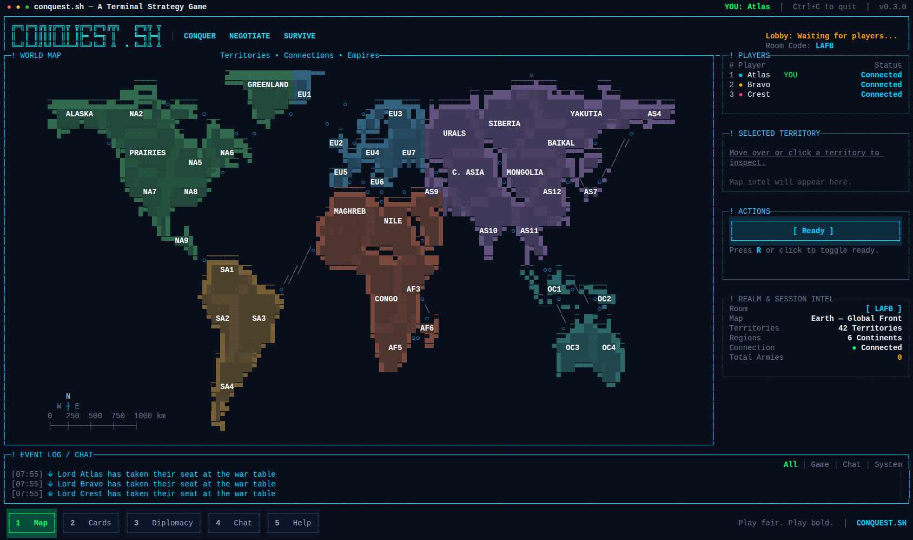
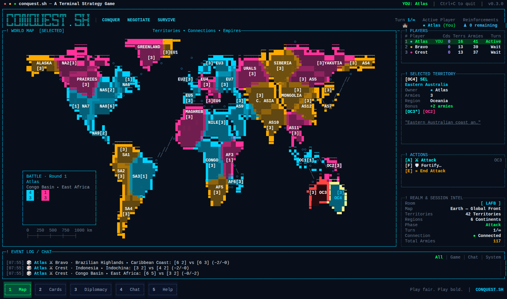
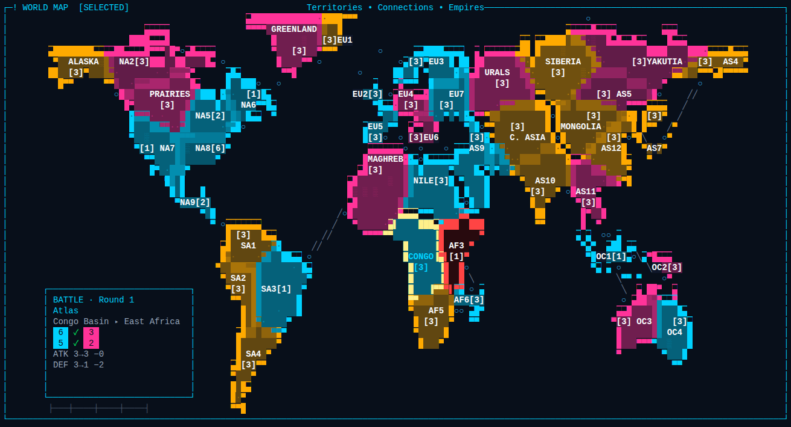
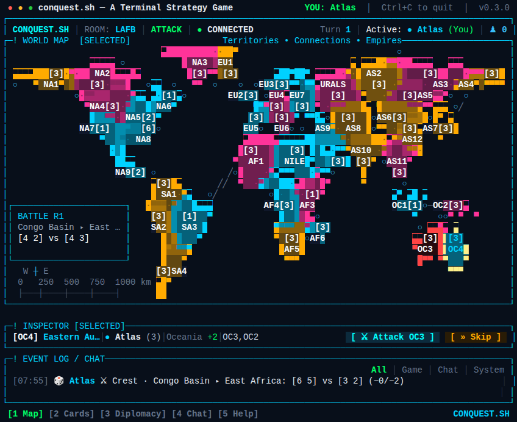
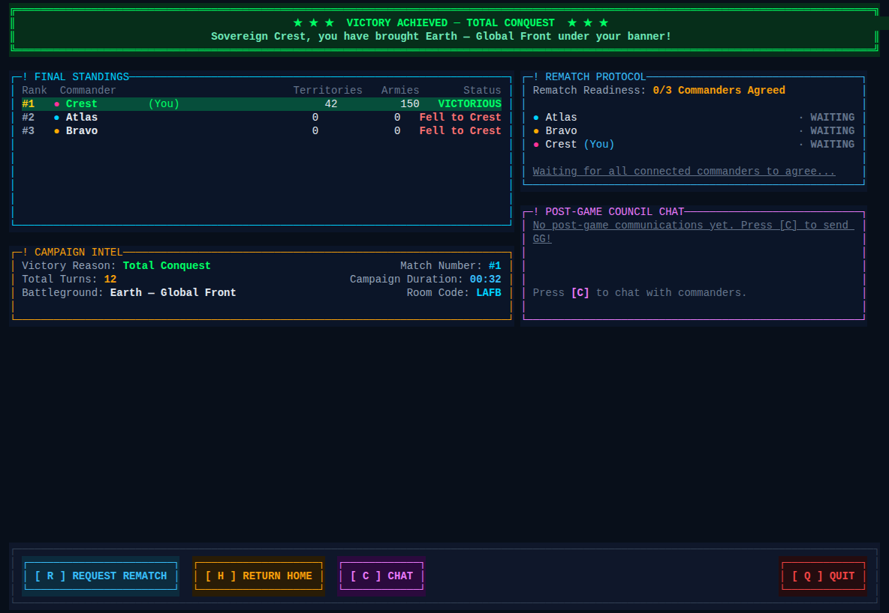

# conquest.sh

> **Multiplayer terminal Risk-style strategy game — play in your terminal, self-host in minutes.**

[](https://github.com/christopherjnelson/conquest.sh/actions/workflows/ci.yml)
[](LICENSE)
[](https://bun.sh)
[](https://www.typescriptlang.org/)
[](https://github.com/anomalyco/opentui)
[](docker-compose.yml)
[](packages/protocol/src/api.ts)
[](CONTRIBUTING.md)



---

## Feature Status

| Feature | Status |
| :--- | :---: |
| Multiplayer rooms (public & unlisted, join by code) | ✅ |
| Reconnect / session resume | ✅ |
| Earth-42 canonical world map (42 territories, 6 continents) | ✅ |
| Deploy / Attack / Fortify / Conquest moves | ✅ |
| Battle report panel (dice, losses, engagement totals) | ✅ |
| In-game event log & chat | ✅ |
| Rematches | ✅ |
| Turn timers & disconnect-forfeit | ✅ |
| Self-hosting (Docker Compose or standalone Bun) | ✅ |
| Risk cards | ✅ |
| Diplomacy | 🚧 |
| Dedicated chat view / DMs | 🚧 |
| AI bots | 🚧 |
| Spectators | 🚧 |
| Persistent rooms / replays | 🚧 |

---

## Screenshots

<details>
<summary>Gallery</summary>

**Home screen**


**Lobby — players and ready states**


**Active match — Earth-42, wide layout**


**Battle report panel after an attack**


**Compact layout (small terminal)**


**Match results screen**


</details>

---

## Quickstart

### Prerequisites

- [Bun](https://bun.sh) (pinned to **1.4.2** via `.bun-version`)

### 1. Install Dependencies

```bash
bun install --frozen-lockfile
```

### 2. Start a Local Server

```bash
./conquest-server.sh
```

The server listens on port 4000 by default.

### 3. Connect a Client

```bash
./conquest.sh
```

Arrives at the multiplayer home screen. To skip the front door:

```bash
# Join an existing room by code
./conquest.sh --room ABCD --name "YourName"

# Connect to a remote server
./conquest.sh --server wss://conquest.example.com --room ABCD
```

### 4. Verify the Test Suite

```bash
bun run check
```

Runs the full test suite (game rules, map geometry, UI components, server networking, client reconnection) followed by TypeScript verification.

---

## Self-Hosting

### Option A: Docker Compose (Recommended)

```bash
docker compose up -d
docker compose logs -f
./conquest.sh --server localhost:4000
```

Data persists to the named `conquest-data` Docker volume (`/data/conquest.sqlite`).

### Option B: Standalone Bun Server

```bash
./conquest-server.sh --port 4000 --name "My Battle Realm"
```

### Configuration

CLI flags take precedence over environment variables.

| CLI Flag | Environment Variable | Default | Description |
| :--- | :--- | :--- | :--- |
| `-p, --port` | `CONQUEST_PORT` | `4000` | Port to bind HTTP & WebSocket server |
| `-n, --name` | `CONQUEST_SERVER_NAME` | `conquest.sh-server` | Server name shown in lobby and browser |
| `-m, --map` | `CONQUEST_MAP` | `earth-42` | Default map: `earth-42`, `ironreach`, `sector-07` |
| `-d, --db` | `CONQUEST_DB_PATH` | `:memory:` | SQLite session database path |
| `--max-players` | `CONQUEST_MAX_PLAYERS` | `4` | Default max players per room |
| `--max-rooms` | `CONQUEST_MAX_ROOMS` | `500` | Max concurrent rooms; `create_room` returns `SERVER_FULL` beyond this |
| `--disconnect-grace` | `CONQUEST_DISCONNECT_GRACE_MS` | `60000` | Grace period (ms) before a disconnected active player's turn is auto-forfeited (`0` = disabled) |
| `--turn-timeout` | `CONQUEST_TURN_TIMEOUT_MS` | `0` | Per-turn time limit (ms); `0` = no limit. Expired turns are forfeited as `timeout`. Clients receive `turnDeadlineAt` for countdown display. |
| `--abandon-timeout` | `CONQUEST_ABANDON_TIMEOUT_MS` | `600000` | ms before an active room with all players disconnected is removed (default 10 min) |

Client server address resolution order: `--server <host>` → `CONQUEST_SERVER` env → `localhost:4000`.

---

## Controls

### Mouse

| Action | Effect |
| :--- | :--- |
| Click owned territory | Select as deployment / attack source |
| Click adjacent enemy | Set as attack target |
| Click friendly territory (connected) | Set as fortify destination |
| Click `[ Deploy ]` | Commit pending deployment |
| Click `[ Attack ]` | Execute attack |
| Click `[ Fortify ]` | Move troops to connected territory |
| Click `[ Skip / End Turn ]` | Open phase-skip confirmation |
| Hover | Preview territory intel, owner, and garrison |

### Keyboard

| Key | Action |
| :--- | :--- |
| `Arrow Keys` | Spatial 2D navigation by territory centroid geometry |
| `Tab` / `Shift+Tab` | Cycle selection across territories |
| `N` / `Shift+N` | Cycle legal attack or fortify targets |
| `[` / `]` | Decrease / increase deployment count |
| `0` | Set deployment count to one |
| `D` | Deploy the chosen amount to the selected territory |
| `A` | Attack targeted enemy territory |
| `Left` / `Right`, then `Enter` | Choose and confirm troop move after conquest |
| `F` | Fortify troops between connected friendly territories |
| `E` | Skip attack phase or end turn (opens confirmation) |
| `Enter` | Confirm armed action |
| `Esc` | Cancel / clear selection |
| `R` | Toggle ready in lobby |
| `C` | Open in-game chat |
| `Q` | Quit or return to previous screen |
| `1`–`5` | Switch bottom tabs (Map / Cards / Diplomacy / Chat / Help) |
| `2` | Open / close the Cards panel |

---

## Architecture

See [docs/ARCHITECTURE.md](docs/ARCHITECTURE.md) for detailed technical specifications, the delta protocol, state-projection design, and map platform API.

**Key design points:**

- **Server-authoritative:** Clients emit typed intents; the server validates, executes, and broadcasts events plus per-player projected state deltas (protocol v0.5.0).
- **Delta protocol:** Each player receives only the fields of `GameState` relevant to their view. Unresolvable gaps trigger a full `client:resync`.
- **Seeded sfc32 RNG:** Each match draws a fresh 16-byte seed from the OS CSPRNG. The seed drives territory shuffles and all dice rolls and stays server-only; clients never see it.
- **Responsive TUI:** Three layout modes — wide (≥ 180 cols × 51 rows), standard, and compact — driven by OpenTUI (`@opentui/core` + `@opentui/react`).
- **Map platform:** Logical topology is separate from terminal render variants. Earth-42 ships six render profiles (compact through ultra); maps are registered bundles.

> [!NOTE]
> **Persistence model:** Client session tokens and player associations persist to SQLite. Active game state is maintained in server memory. Client disconnects and terminal restarts reconnect seamlessly, but ongoing games do not survive a full server process restart.

---

## Adding a Map

1. Define the logical map: territory IDs, names, regions, bonuses, and bidirectional adjacency.
2. Provide one or more render variants at different terminal sizes (raster geometry, labels, army-marker anchors, sea routes).
3. Register the bundle in `packages/map-engine`.
4. Add topology and geometry tests, including route validation for non-land adjacencies.

See [docs/ARCHITECTURE.md § 5](docs/ARCHITECTURE.md#5-map-platform-and-built-in-maps) for the full API boundary.

---

## Cards

When a room is created with **Cards: Escalating** mode, a standard territory deck (one card per territory, plus two wilds) is shuffled at match start.

**Earning cards:** A player who conquers at least one territory during their turn receives one card at the end of that turn (drawn face-down, hidden from other players).

**Trading sets:** Three-of-a-kind (Infantry / Cavalry / Artillery) or one of each count as a valid set. Wilds substitute for any symbol. Trading a set earns armies on an escalating schedule: 4 → 6 → 8 → 10 → 12 → 15, then +5 each trade thereafter. If either traded card matches a territory you own, you receive a +2 territory bonus on that territory.

**Forced trades:** A player who holds 5 or more cards at the start of their deployment phase, or who ends an elimination and captures cards bringing their hand to 6 or more, must trade immediately before proceeding. The earned armies are placed during the normal deployment step (or immediately if the forced trade occurs during the attack phase). Attacks and phase-skips are blocked until all forced-trade armies are deployed.

**Options:** Set `cardMode` to `"escalating"` (default when cards are enabled) or `"off"` when creating a room. The mode is shown in the room browser and carried through the full client → server path.

---

## Roadmap

- **Diplomacy** — in-game messaging, non-aggression pacts
- **Dedicated chat view / DMs**
- **AI bots**
- **Spectator mode**
- **Persistent rooms & replays**

---

## Contributing

See [CONTRIBUTING.md](CONTRIBUTING.md) for setup, test conventions, and the branch/PR flow.

## Security

See [SECURITY.md](SECURITY.md) for responsible disclosure instructions.

## License

MIT — see [LICENSE](LICENSE).
